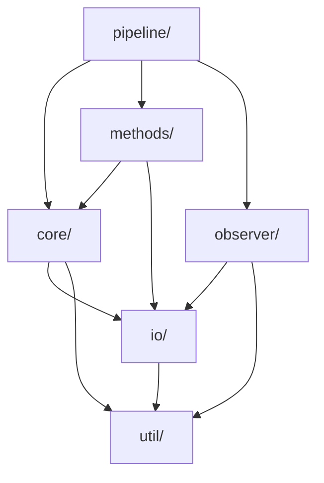

# Package Structure
{: .no_toc }

Module organization and architecture of openamundsen_da.
{: .fs-6 .fw-300 }

## Table of contents
{: .no_toc .text-delta }

1. TOC
{:toc}

---

## Overview

The `openamundsen_da` package is organized into 8 main modules, each with specific responsibilities in the data assimilation workflow.

---

## Module Hierarchy

```
openamundsen_da/
├── core/              # Core DA functionality
├── io/                # Input/output operations
├── observer/          # Satellite observation processing
├── methods/           # DA algorithms and operators
│   ├── pf/           # Particle filter
│   ├── h_of_x/       # Forward operators
│   ├── wet_snow/     # Wet snow detection
│   └── viz/          # Visualization
├── pipeline/          # High-level workflows
├── util/              # Utility functions
└── __init__.py        # Package initialization
```

---

## Core Module (`core/`)

**Purpose**: Core data assimilation functionality

**Key Components**:

### `config.py`
- Configuration loading and validation
- YAML parsing for `project.yml`, `season.yml`, `step.yml`
- Default value handling

### `prior_forcing.py`
- Meteorological forcing perturbations
- Temperature: `T_pert = T + ε_T`, where `ε_T ~ N(0, σ_T²)`
- Precipitation: `P_pert = P × exp(ε_P)`, where `ε_P ~ N(0, σ_P²)`
- Rebase mode support

### `launch.py`
- Parallel ensemble execution
- Worker pool management
- State pointer handling (warm start)

### `runner.py`
- Single member execution wrapper
- openAMUNDSEN model invocation
- Log capture and error handling

---

## I/O Module (`io/`)

**Purpose**: File operations and data manipulation

**Key Components**:

### `file_ops.py`
- Copy/move operations for ensemble propagation
- Directory structure management
- Atomic file operations

### `raster_ops.py`
- GeoTIFF reading/writing
- Reprojection and resampling
- ROI clipping

### `netcdf_ops.py`
- NetCDF file handling
- Variable extraction
- Time series processing

---

## Observer Module (`observer/`)

**Purpose**: Satellite observation preprocessing

**Key Components**:

### `mod10a1_preprocess.py`
- MODIS MOD10A1 HDF processing
- QA masking and cloud filtering
- NDSI thresholding and SCF calculation

### `snowflake_fsc.py`
- Sentinel-2 FSC processing
- Snowflake product integration
- Quality filtering

### `satellite_wet_snow_s1.py`
- Sentinel-1 wet snow mask processing
- Radar shadow exclusion
- Class mapping (110=wet, 125=dry)

---

## Methods Module (`methods/`)

**Purpose**: Data assimilation algorithms

### Particle Filter (`methods/pf/`)

#### `assimilate.py`
- Main assimilation loop
- Observation loading
- Likelihood calculation
- Weight normalization

#### `resampling.py`
- Systematic resampling algorithm
- ESS (Effective Sample Size) calculation
- Index generation for particle selection

#### `rejuvenation.py`
- Post-resampling perturbations
- Ensemble spread restoration
- Rebase mode support

### Forward Operators (`methods/h_of_x/`)

#### `scf_from_model.py`
- Compute model SCF from snow depth/SWE
- Depth threshold method
- Logistic function method

#### `wet_snow_from_model.py`
- Compute model wet snow from LWC
- Binary classification

### Wet Snow (`methods/wet_snow/`)

#### `likelihood.py`
- Wet snow observation likelihood
- Binary observation handling

### Visualization (`methods/viz/`)

#### `plot_results_ensemble.py`
- Ensemble time series plots
- Percentile envelopes (5th-95th)

#### `plot_scf_timeseries.py`
- SCF comparison plots (obs vs. model)

#### `plot_weights.py`
- Particle weight bar plots
- Residual histograms

#### `plot_ess.py`
- ESS timeline visualization
- Resampling event markers

---

## Pipeline Module (`pipeline/`)

**Purpose**: High-level workflow orchestration

**No `__init__.py`** (intentional - entry points only)

### `season_skeleton.py`
- Create season directory structure
- Generate step folders aligned to assimilation dates
- Auto-generate `step_XX.yml` configs

### `season.py`
- Full season automation
- Loop over all steps:
  1. Generate prior forcing
  2. Run prior ensemble
  3. Compute model H(x)
  4. Assimilate observations
  5. Resample if ESS < threshold
  6. Rejuvenate
  7. Propagate to next step
- Performance monitoring

### `step.py`
- Single assimilation step execution
- Used for testing or manual control

---

## Util Module (`util/`)

**Purpose**: General utility functions

**Key Components**:

### `logging_config.py`
- Centralized logging setup
- File and console handlers
- Log level configuration

### `path_utils.py`
- Path manipulation helpers
- Platform-independent path handling

### `performance.py`
- CPU, RAM, disk monitoring
- ETA estimation
- Live performance plotting

---

## Entry Points (CLI)

Defined in `pyproject.toml`:

```toml
[project.scripts]
# Observation preprocessing
oa-da-mod10a1 = "openamundsen_da.observer.mod10a1_preprocess:main"
oa-da-snowflake = "openamundsen_da.observer.snowflake_fsc:main"
oa-da-s1-wetsnow = "openamundsen_da.observer.satellite_wet_snow_s1:main"

# Observation extraction
oa-da-scf = "openamundsen_da.observer.scf_from_summary:main"

# Pipeline commands
oa-da-season-skeleton = "openamundsen_da.pipeline.season_skeleton:main"
oa-da-season = "openamundsen_da.pipeline.season:main"
oa-da-step = "openamundsen_da.pipeline.step:main"

# Forcing generation
oa-da-prior-forcing = "openamundsen_da.core.prior_forcing:main"

# Ensemble execution
oa-da-launch = "openamundsen_da.core.launch:main"

# H(x) computation
oa-da-model-scf = "openamundsen_da.methods.h_of_x.scf_from_model:main"
oa-da-model-wetsnow = "openamundsen_da.methods.wet_snow.wet_snow_from_model:main"

# Assimilation
oa-da-assimilate = "openamundsen_da.methods.pf.assimilate:main"

# Visualization
oa-da-plot-scf = "openamundsen_da.methods.viz.plot_scf_timeseries:main"
oa-da-plot-weights = "openamundsen_da.methods.viz.plot_weights:main"
oa-da-plot-ess = "openamundsen_da.methods.viz.plot_ess:main"
oa-da-plot-results = "openamundsen_da.methods.viz.plot_results_ensemble:main"
```

---

## Dependency Graph



---

## Design Principles

### 1. Modularity
Each module has a single, well-defined responsibility.

### 2. CLI-First
Every major operation is accessible via command-line entry point.

### 3. Stateless Execution
Functions operate on files, not in-memory state (enables parallelization and checkpointing).

### 4. Configuration-Driven
Behavior controlled via YAML config files, not code changes.

### 5. Minimal Dependencies
Only essential packages (numpy, pandas, xarray, GDAL, openAMUNDSEN).

---

## Extension Points

### Adding a New Observation Type

1. Create preprocessor in `observer/`:
   ```python
   # observer/new_product.py
   def preprocess_new_product(...):
       # Convert to standard format
       pass
   ```

2. Add forward operator in `methods/h_of_x/`:
   ```python
   # methods/h_of_x/new_obs_from_model.py
   def compute_new_obs_h_of_x(...):
       # Map model state to observation space
       pass
   ```

3. Update assimilation loop in `methods/pf/assimilate.py`

### Adding a New Resampling Algorithm

1. Implement in `methods/pf/resampling.py`:
   ```python
   def stratified_resampling(weights, N, seed):
       # Your algorithm
       return indices
   ```

2. Update configuration schema to accept new algorithm name

### Adding a New Perturbation Method

1. Extend `core/prior_forcing.py`:
   ```python
   def perturb_wind_direction(wind_dir, sigma, seed):
       # Circular perturbation
       pass
   ```

2. Add configuration parameters to `project.yml` schema

---

## Next Steps

- [API Reference]({{ site.baseurl }}) - Function signatures
- [Data Assimilation Methods]({{ site.baseurl }}) - Algorithm details
- [Configuration Reference]({{ site.baseurl }}) - YAML settings
