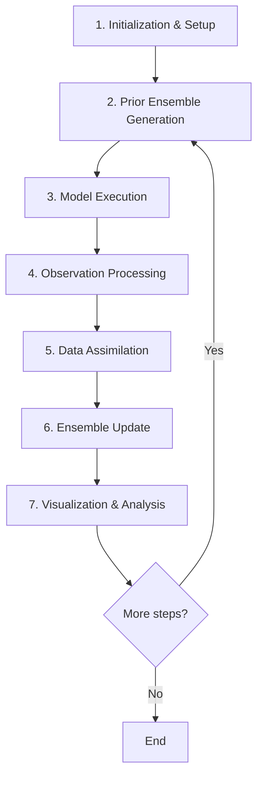

# Data Assimilation Workflow
{: .no_toc }

Understanding the particle filter data assimilation cycle.
{: .fs-6 .fw-300 }

## Table of contents
{: .no_toc .text-delta }

1. TOC
{:toc}

---

## Workflow Overview

The openamundsen_da framework implements a sequential particle filter for snow data assimilation. The workflow consists of 7 main phases that repeat for each assimilation cycle.



---

## Phase 1: Initialization & Setup

### Project Structure Definition

Create the required directory structure:
- `env/` - ROI and glacier masks
- `meteo/` - Meteorological forcing data
- `obs/` - Satellite observations
- `propagation/` - Ensemble runs (auto-created)

### Season Skeleton Creation

```bash
docker compose run --rm oa \
  python -m openamundsen_da.pipeline.season_skeleton \
  --project-dir /data \
  --season-dir /data/propagation/season_2019-2020
```

Creates `step_XX_*/` directories with date boundaries aligned to assimilation dates.

### Configuration

Three configuration levels:
1. **project.yml** - Project-wide settings (ensemble size, DA parameters)
2. **season.yml** - Season dates and assimilation events
3. **step_XX.yml** - Step-specific settings (auto-generated)

---

## Phase 2: Prior Ensemble Generation

### Meteorological Forcing Perturbation

**Temperature**: Additive Gaussian noise
```
T_perturbed = T_original + ε_T,  ε_T ~ N(0, σ_T²)
```

**Precipitation**: Multiplicative log-normal noise
```
P_perturbed = P_original × exp(ε_P),  ε_P ~ N(0, σ_P²)
```

**Implementation**:
```bash
docker compose run --rm oa \
  python -m openamundsen_da.core.prior_forcing \
  --input-meteo-dir /data/meteo \
  --project-dir /data \
  --step-dir /data/propagation/season_2019-2020/step_01_*
```

### Open Loop Reference

An unperturbed baseline run using original meteorological data for comparison.

### Ensemble Members

N independent members (member_001, member_002, ..., member_N) with independent perturbations.

---

## Phase 3: Model Execution

### Parallel Ensemble Runs

```bash
docker compose run --rm oa \
  python -m openamundsen_da.core.launch \
  --project-dir /data \
  --season-dir /data/propagation/season_2019-2020 \
  --step-dir /data/propagation/season_2019-2020/step_01_* \
  --ensemble prior \
  --max-workers 8
```

**Features**:
- Parallel execution using `multiprocessing`
- Worker count: `min(max_workers, CPU_count, N_members)`
- Warm-start capability via `state_pointer.json`

### State Management

Each member saves its state at step boundaries:
```json
{
  "state_file": "results/state_20191122_000000.nc",
  "timestamp": "2019-11-22T00:00:00"
}
```

### Results Output

Per member:
- NetCDF grids (snow.nc, meteo.nc)
- Point CSV time series
- Optional model SCF time series

---

## Phase 4: Observation Processing

### MODIS MOD10A1 Preprocessing

```bash
docker compose run --rm oa \
  python -m openamundsen_da.observer.mod10a1_preprocess \
  --input-dir /data/obs/MOD10A1_61_HDF \
  --season-label season_2019-2020 \
  --project-dir /data
```

**Steps**:
1. HDF → GeoTIFF conversion
2. QA masking (cloud-free pixels only)
3. Reprojection to study area CRS
4. ROI clipping
5. NDSI thresholding → binary snow mask
6. SCF calculation per ROI

**Output**: `obs/season_2019-2020/scf_summary.csv`

### Sentinel-2 FSC (Snowflake)

```bash
docker compose run --rm oa \
  python -m openamundsen_da.observer.snowflake_fsc \
  --input-dir /data/obs/FSC_snowflake \
  --season-label season_2019-2020 \
  --project-dir /data
```

### Sentinel-1 Wet Snow

```bash
docker compose run --rm oa \
  python -m openamundsen_da.observer.satellite_wet_snow_s1 \
  --input-dir /data/obs/WSM_S1 \
  --season-label season_2019-2020 \
  --project-dir /data
```

**WSM Classes**:
- 110: Wet snow
- 125: Dry/no snow
- 200: Radar shadow (excluded)
- 210: Water (excluded)

### Glacier Masking

When enabled (`project.yml`):
```yaml
data_assimilation:
  glacier_mask:
    enabled: true
    path: env/glaciers.gpkg
```

Firn/ice areas are excluded from obs-model comparisons to ensure consistency (seasonal snow model vs. observations including glaciers).

---

## Phase 5: Data Assimilation (Particle Filter)

### H(x) Forward Operator

Maps model state (snow depth or SWE) to observation space (SCF).

**Methods**:

1. **Depth Threshold**:
   ```
   SCF = 1  if HS > h0
   SCF = 0  otherwise
   ```

2. **Logistic** (smooth):
   ```
   SCF = 1 / (1 + exp(-k × (HS - h0)))
   ```

**Configuration** (in `project.yml`):
```yaml
data_assimilation:
  h_of_x:
    variable: hs      # 'hs' or 'swe'
    method: logistic  # 'depth_threshold' or 'logistic'
    h0: 0.05         # Threshold (m)
    k: 50.0          # Steepness (logistic only)
```

### Likelihood Weight Calculation

Gaussian likelihood function:
```
w_i ∝ exp(-0.5 × ((y_obs - H(x_i)) / σ_obs)²)
```

where:
- `y_obs`: Observed SCF
- `H(x_i)`: Model SCF for member i
- `σ_obs`: Observation error std (from config)

**Normalization**:
```
w_i = w_i / Σ(w_j)
```

### Effective Sample Size (ESS)

```
ESS = 1 / Σ(w_i²)
```

- ESS = N: All weights equal (no information from obs)
- ESS = 1: One particle dominates (particle degeneracy)
- ESS < threshold → Trigger resampling

---

## Phase 6: Ensemble Update

### Systematic Resampling

**Algorithm**:
1. Generate systematic samples: `u_i = (i + U) / N`, where `U ~ Uniform(0,1)`
2. Map samples to cumulative weight distribution
3. Select members according to mapped indices
4. Duplicate high-weight members, discard low-weight members

**Configuration**:
```yaml
data_assimilation:
  resampling:
    algorithm: systematic
    ess_threshold_ratio: 0.5  # Resample if ESS < 0.5 × N
    seed: 42
```

**Behavior**:
- If `ESS ≥ threshold`: Skip resampling, mirror prior → posterior
- If `ESS < threshold`: Resample

### Rejuvenation

After resampling, ensemble spread is reduced (identical states). Rejuvenation adds noise to maintain spread.

**Rebase mode** (default):
Perturbations applied relative to open loop:
```
forcing_new = open_loop_forcing + new_perturbation
```

**Configuration**:
```yaml
data_assimilation:
  rejuvenation:
    sigma_t: 0.2  # Usually smaller than prior
    sigma_p: 0.2
```

### State Propagation

Copy posterior states + perturbed forcing to next step's prior:
```
step_N/ensembles/posterior/member_i/ → step_N+1/ensembles/prior/member_j/
```

where `j = indices[i]` from resampling.

---

## Phase 7: Visualization & Analysis

### Forcing Plots

Per-station temperature and precipitation time series showing:
- Open loop
- All ensemble members
- Ensemble mean ± spread

### Results Plots

SWE, snow depth, SCF time series:
- Ensemble mean
- 90% envelope (5th-95th percentiles)
- Open loop
- Observations (when available)

### Weight & Residual Plots

Per assimilation date:
- Normalized particle weights (bar plot)
- Observation-model residuals (histogram)
- ESS value

### ESS Timeline

Season-wide ESS evolution:
- ESS vs. time
- ESS threshold (horizontal line)
- Resampling events (markers)

### Performance Monitoring

When enabled (`--monitor-perf`):
- CPU usage
- Memory (RSS, system)
- Disk usage
- ETA estimation

**Output**: `plots/perf/season_perf.png` (live-updated)

---

## Automated Season Pipeline

The season pipeline automates all phases:

```bash
docker compose run --rm oa \
  python -m openamundsen_da.pipeline.season \
  --project-dir /data \
  --season-dir /data/propagation/season_2019-2020 \
  --max-workers 8 \
  --monitor-perf
```

**Pipeline steps** (per assimilation cycle):
1. Generate prior forcing
2. Run prior ensemble
3. Compute model H(x) (SCF/wet-snow)
4. Assimilate observations → weights
5. Check ESS → resample if needed
6. Rejuvenate → next prior
7. Generate plots
8. Repeat for next step

---

## Best Practices

### Ensemble Size

- **Small domains** (< 100 km²): 20-30 members
- **Medium domains**: 30-50 members
- **Large domains** (> 500 km²): 50-100 members

Trade-off: More members = better posterior but higher computational cost.

### Perturbation Magnitudes

**Prior**:
- `σ_T`: 1.0-2.0 K (typical)
- `σ_P`: 0.15-0.25 (15-25% uncertainty)

**Rejuvenation**: Use smaller values (0.1-0.2) to avoid over-perturbation.

### ESS Threshold

- `ess_threshold_ratio = 0.5`: Resample when ESS < 50% of ensemble size
- Lower threshold: Less frequent resampling but risk of degeneracy
- Higher threshold: More resampling but may lose diversity

### Observation Error

Depends on data source:
- MODIS MOD10A1: σ_obs ≈ 0.1-0.15
- Sentinel-2 FSC: σ_obs ≈ 0.05-0.10
- In-situ: σ_obs ≈ 0.05

Configure in `project.yml`:
```yaml
data_assimilation:
  observation_error:
    scf: 0.10
    wet_snow: 0.15
```

---

## Next Steps

- [Configuration Guide]({{ site.baseurl }}) - Detailed configuration reference
- [Running Experiments]({{ site.baseurl }}) - Step-by-step experiment setup
- [CLI Reference]({{ site.baseurl }}) - Command-line tools
